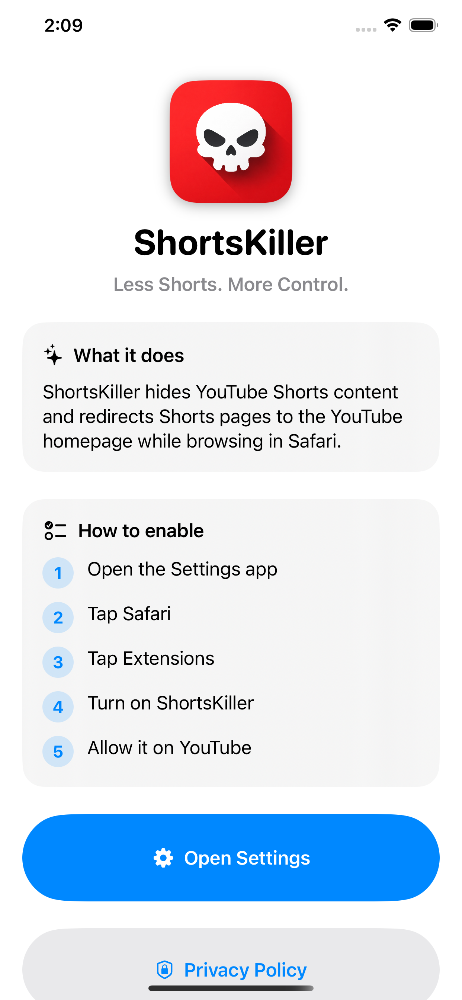
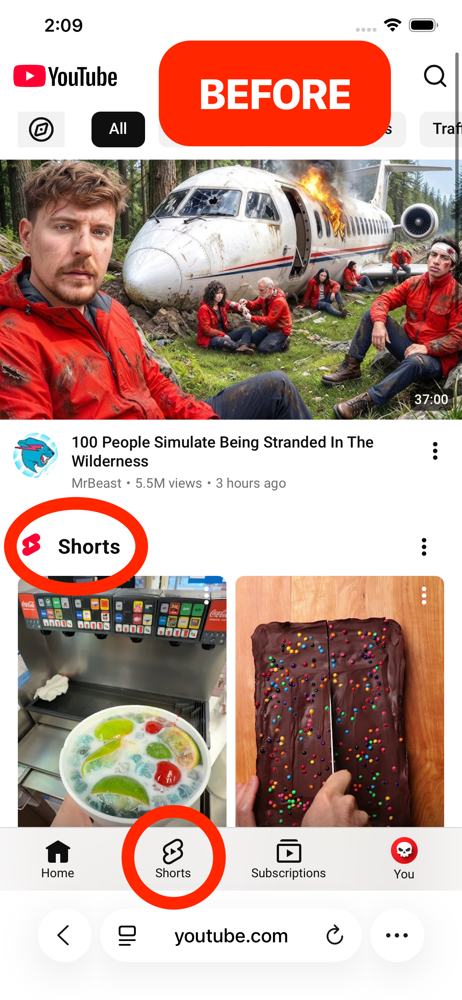
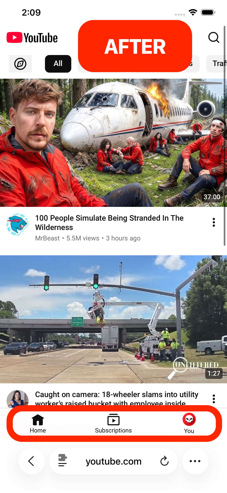

# ShortsKiller

ShortsKiller is a Safari Web Extension for iOS that removes YouTube Shorts for a cleaner, less distracting browsing experience.

<p align="center">
  
</p>

## Features

- Hides YouTube Shorts from the YouTube interface
- Redirects `/shorts` URLs away from Shorts pages
- Runs locally in Safari
- Lightweight and fast
- No tracking, analytics, accounts, or data collection

## Screenshots

| App Home | Before Enabled | After Enabled |
| --- | --- | --- |
|  |  |  |

## How It Works

ShortsKiller runs locally in Safari and modifies YouTube pages in the browser to remove Shorts-related elements. When a Shorts URL is opened, the extension redirects away from the Shorts page.

ShortsKiller does not collect, store, transmit, sell, or share personal data.

## Installation

1. Download ShortsKiller from the App Store.
2. Open the ShortsKiller app for setup instructions.
3. Open **Settings → Safari → Extensions**.
4. Enable **ShortsKiller**.
5. Allow ShortsKiller permission to run on YouTube.

## Support

For support, questions, or feedback, email:

**support.shortskiller@gmail.com**

You can also visit the support page:

[ShortsKiller Support](https://jskelly2021.github.io/ShortsKiller/)

## Privacy

ShortsKiller does not collect, store, or share any personal data.

Read the full policy:

[Privacy Policy](https://jskelly2021.github.io/ShortsKiller/privacy.html)

## Development

### Requirements

- Xcode
- iOS device for testing Safari extensions

### Run Locally

1. Clone the repository.
2. Open the project in Xcode.
3. Build and run the host app on an iOS device.
4. Enable the extension in **Settings → Safari → Extensions**.

## Project Structure

```text
App/          Host iOS app
Extension/    Safari Web Extension
  manifest.json
  content.js
  content.css
images/       App/support page images
```

## License

MIT License
